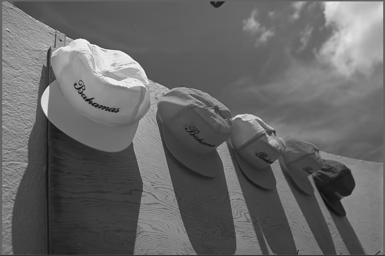
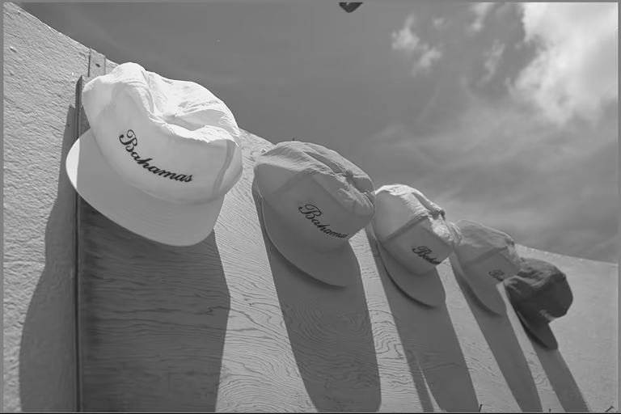
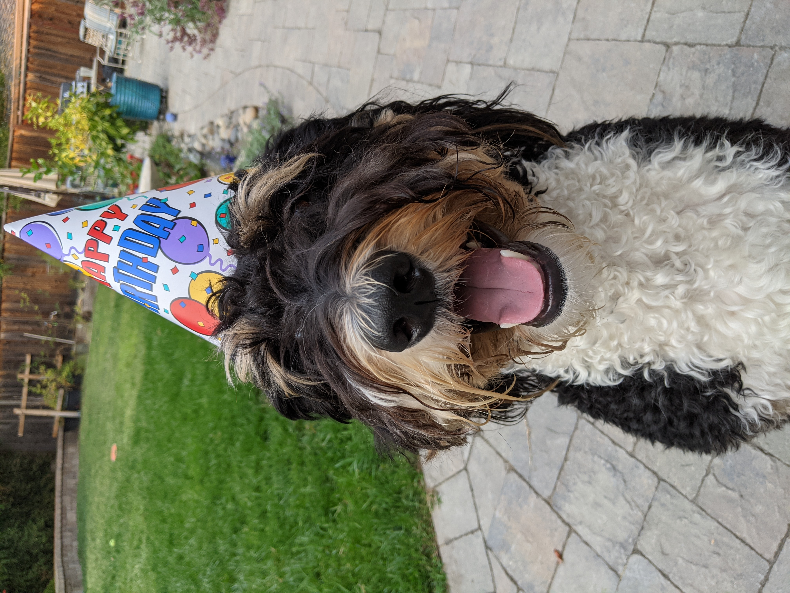
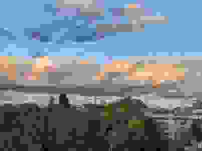
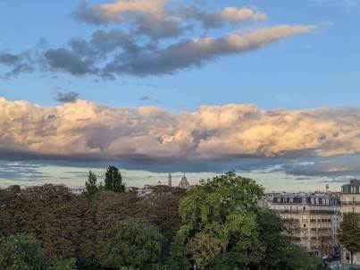
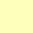
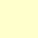
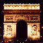
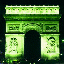
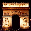

# Test images

## Still images

### File [circle-trns-after-plte.png](circle-trns-after-plte.png)


An opaque blue circle on a transparent green background.

It is of color type 2 (PNG_COLOR_TYPE_RGB) and has a tRNS chunk after a PLTE
chunk.

### File [circle-trns-before-plte.png](circle-trns-before-plte.png)


An opaque blue circle on a transparent green background.

It is of color type 2 (PNG_COLOR_TYPE_RGB) and has a tRNS chunk before a PLTE
chunk. Since the PNG specification version 1.2 says "the tRNS chunk [...] must
follow the PLTE chunk, if any", libpng considers the tRNS chunk as invalid and
ignores it.

### File [draw_points.png](draw_points.png)


Source: Generated with ImageMagick's `convert` command:

```
  convert -size 3x1 xc:red -alpha on -fill '#00F8' \
          -draw 'point 1,0' \
          -draw 'color 2,0 point' -scale 33x33 draw_points.png
```

It is of color type 3 (PNG_COLOR_TYPE_PALETTE) and has a tRNS chunk.

### Files `kodim*`

#### File [kodim03_yuv420_8bpc.avif](io/kodim03_yuv420_8bpc.avif)


License: released by the Eastman Kodak Company for unrestricted usage

#### File [kodim03_grayscale_gamma1.6.png](kodim03_grayscale_gamma1.6.png)



License: released by the Eastman Kodak Company for unrestricted usage

It is [kodim03_yuv420_8bpc.avif](io/kodim03_yuv420_8bpc.avif) converted to
grayscale and tagged as Gamma 1.6 gAMA PNG chunk.

#### File [kodim03_grayscale_gamma1.6-reference.png](kodim03_grayscale_gamma1.6-reference.png)



License: released by the Eastman Kodak Company for unrestricted usage

It is [kodim03_grayscale_gamma1.6.png](kodim03_grayscale_gamma1.6.png)
converted into sRGB colorspace by Chrome using "Capture Node Screenshot"
in DevTools.

#### File [kodim23_yuv420_8bpc.avif](io/kodim23_yuv420_8bpc.avif)


License: released by the Eastman Kodak Company for unrestricted usage

Source: <http://r0k.us/graphics/kodak/>

### Files `cosmos*`

#### File [cosmos1650_yuv444_10bpc_p3pq.avif](io/cosmos1650_yuv444_10bpc_p3pq.avif)


License: [Creative Commons Attribution license (reuse allowed)](https://creativecommons.org/licenses/by/3.0/legalcode)

Source: ["Cosmos Laundromat" movie](https://www.youtube.com/watch?v=Y-rmzh0PI3c) (frame at around 1 minute past the
beginning)

### Files with high bit depth per channel

#### File [weld_16bit.png](weld_16bit.png)


License: "Irrevocable, nonexclusive, worldwide copyright license to download, copy, modify, distribute, perform, and use
raw files from Signature Edits for free, including for commercial purposes, without permission from or attributing the
photographer or Signature Edits."

Source: Picture from https://www.signatureedits.com/free-raw-photos/, rescaled, modified color balance and converted
with GIMP+Darktable to 16b PNG, metadata removed with `exiftool -All=`.

## Metadata

The structure can be displayed using `exiv2 -pS <file>`.

### File [dog_exif_extended_xmp_icc.jpg](dog_exif_extended_xmp_icc.jpg)



License: [same as libavif](https://github.com/AOMediaCodec/libavif/blob/main/LICENSE)

Source: Personal photo.

| address | marker      | length | data                                         |
|--------:|-------------|-------:|----------------------------------------------|
|       0 | 0xffd8 SOI  |        |                                              |
|       2 | 0xffe1 APP1 |    884 | `Exif..II*......................`            |
|     888 | 0xffe1 APP1 |    353 | `http://ns.adobe.com/xap/1.0/.<x:`           |
|    1243 | 0xffe1 APP1 |  32417 | `http://ns.adobe.com/xmp/extensio`           |
|   33662 | 0xffe0 APP0 |     16 | `JFIF.........`                              |
|         |             |        | ...                                          |
|   33818 | 0xffe2 APP2 |    612 | `ICC_PROFILE......T........mntrRG chunk 1/1` |
|         |             |        | ...                                          |

### File [paris_exif_xmp_icc.jpg](paris_exif_xmp_icc.jpg)


License: [same as libavif](https://github.com/AOMediaCodec/libavif/blob/main/LICENSE)

Source: Personal photo edited with Gimp 2.10.

| address | marker      | length | data                                         |
|--------:|-------------|-------:|----------------------------------------------|
|       0 | 0xffd8 SOI  |        |                                              |
|       2 | 0xffe0 APP0 |     16 | `JFIF.....,.,.`                              |
|      20 | 0xffe1 APP1 |   1134 | `Exif..II*......................`            |
|    1156 | 0xffe1 APP1 |   3929 | `http://ns.adobe.com/xap/1.0/.<?x`           |
|    5087 | 0xffe2 APP2 |    612 | `ICC_PROFILE......T........mntrRG chunk 1/1` |
|         |             |        | ...                                          |

### File [paris_extended_xmp.jpg](paris_extended_xmp.jpg)


License: [same as libavif](https://github.com/AOMediaCodec/libavif/blob/main/LICENSE)

Source: Metadata was extracted from `paris_exif_xmp_icc.jpg` with
`exiftool -tagsfromfile paris_exif_xmp_icc.jpg paris_exif_xmp_icc.xmp`. The text of the first book of
[De finibus bonorum et malorum](https://en.wikipedia.org/wiki/De_finibus_bonorum_et_malorum) was manually inserted in
that file under the tag `xmp:Label` and the second book under the tag `xmp:Nickname` (any `<` or `>` removed to avoid
conflicts with XMP). The file was reconstructed with
`exiftool -tagsfromfile paris_exif_xmp_icc.xmp -Exif= -icc_profile= paris_exif_xmp_icc.jpg -o paris_extended_xmp.jpg`.
The goal is to have a large XMP blob so that it can only be stored as multiple extended XMP chunks.

|  address | marker      | length | data                             |
|---------:|-------------|-------:|----------------------------------|
|        0 | 0xffd8 SOI  |        |                                  |
|        2 | 0xffe0 APP0 |     16 | `JFIF.....,.,.`                  |
|       20 | 0xffe1 APP1 |   5531 | http://ns.adobe.com/xap/1.0/.<?x |
|     5553 | 0xffe1 APP1 |  65535 | http://ns.adobe.com/xmp/extensio |
|    71090 | 0xffe1 APP1 |  65535 | http://ns.adobe.com/xmp/extensio |
|   136627 | 0xffe1 APP1 |   4791 | http://ns.adobe.com/xmp/extensio |
|          |             |        | ...                              |

### File [paris_xmp_trailing_null.jpg](paris_xmp_trailing_null.jpg)



License: [same as libavif](https://github.com/AOMediaCodec/libavif/blob/main/LICENSE)

Source: `paris_exif_xmp_icc.jpg` loaded with `avifReadImage()`, stripped of ICC and Exif, a zero byte appended to XMP,
then written with `avifJPEGWrite()` with quality 0 (without calling `avifImageFixXMP()`).

| address | marker      | length | data                                         |
|--------:|-------------|-------:|----------------------------------------------|
|       0 | 0xffd8 SOI  |        |                                              |
|       2 | 0xffe0 APP0 |     16 | `JFIF.........`                              |
|      20 | 0xffe1 APP1 |   3930 | `http://ns.adobe.com/xap/1.0/.<?x`           |
|         |             |        | ...                                          |

### File [paris_icc_exif_xmp.png](paris_icc_exif_xmp.png)


License: [same as libavif](https://github.com/AOMediaCodec/libavif/blob/main/LICENSE)

Source: `paris_exif_xmp_icc.jpg` loaded with `avifReadImage()` then written with `avifPNGWrite()` (modified to output
metadata this way).

| address | marker | length | data                             |
|--------:|--------|-------:|----------------------------------|
|       8 | IHDR   |     13 |                                  |
|      33 | iCCP   |    386 | `libavif..(.u..+DQ..?3...E.....` |
|     431 | zTXt   |    631 | `Raw profile type exif..H...[..` |
|    1074 | zTXt   |   1076 | `Raw profile type xmp..X..YQ..8` |
|    2162 | IDAT   |        | ...                              |
|  160456 | IEND   |      0 |                                  |

### File [paris_icc_exif_xmp_at_end.png](paris_icc_exif_xmp_at_end.png)



License: [same as libavif](https://github.com/AOMediaCodec/libavif/blob/main/LICENSE)

Source: `paris_exif_xmp_icc.jpg` loaded with `avifReadImage()` then written with `avifPNGWrite()` (modified to output
metadata this way).

| address | marker | length | data                             |
|--------:|--------|-------:|----------------------------------|
|       8 | IHDR   |     13 |                                  |
|      33 | iCCP   |    386 | `libavif..(.u..+DQ..?3...E.....` |
|    2162 | IDAT   |        | ...                              |
|  151474 | eXIf   |   1126 | `II*..........................`  |
|  152612 | tEXt   |   7832 | `Raw profile type xmp..XMP.0000` |
|  160456 | IEND   |      0 |                                  |

### File [paris_exif_orientation_5.jpg](paris_exif_orientation_5.jpg)


License: [same as libavif](https://github.com/AOMediaCodec/libavif/blob/main/LICENSE)

Source: `paris_exif_xmp_icc.jpg` stripped of all metadata with `exiftool -all=` and Exif orientation added
with `exiv2 -k -M "set Exif.Image.Orientation 5"`

| address | marker      |  length | data                                 |
|--------:|-------------|--------:|--------------------------------------|
|       0 | 0xffd8 SOI  |         |                                      |
|       2 | 0xffe1 APP1 |      34 | `Exif..II*......................`    |
|         |             |         | ...                                  |

### File [paris_icc_exif_xmp.avif](paris_icc_exif_xmp.avif)


License: [same as libavif](https://github.com/AOMediaCodec/libavif/blob/main/LICENSE)

Source: Encoded from `paris_icc_exif_xmp.png` using `avifenc -s 10` at commit ed52c1b.

### File [ffffcc-gamma1.6.png](ffffcc-gamma1.6.png)



License: Creative Commons Attribution-NonCommercial 2.5 License

Source: Picture from the libpng test page
http://www.libpng.org/pub/png/colorcube/colorcube-pngs-gamma16.html.

It's a color image tagged as gamma 1.6.

### File [ffffcc-gamma1.6.png](ffffcc-gamma1.6.png)



License: Creative Commons Attribution-NonCommercial 2.5 License

Source: Picture from the libpng test page
http://www.libpng.org/pub/png/colorcube/colorcube-pngs-gamma22.html.

It's a color image tagged as gamma 2.2.

### File [ffffff-gamma1.6.png](ffffff-gamma1.6.png)


License: Creative Commons Attribution-NonCommercial 2.5 License

Source: Picture from the libpng test page
http://www.libpng.org/pub/png/colorcube/colorcube-pngs-gamma16.html.

It's a grayscale image tagged as gamma 1.6.

### File [ffffff-gamma2.2.png](ffffff-gamma2.2.png)


License: Creative Commons Attribution-NonCommercial 2.5 License

Source: Picture from the libpng test page
http://www.libpng.org/pub/png/colorcube/colorcube-pngs-gamma22.html.

It's a grayscale image tagged as gamma 2.2.

### File [ffffcc-srgb.png](ffffcc-srgb.png)


License: Creative Commons Attribution-NonCommercial 2.5 License

Source: Picture from the libpng test page
http://www.libpng.org/pub/png/colorcube/colorcube-pngs-sRGB.html.

It's a color image tagged as sRGB.

### File [ArcTriomphe-cHRM-orig.png](ArcTriomphe-cHRM-orig.png)



License: Creative Commons Attribution-NonCommercial 2.5 License

Source: Picture from the libpng test page
http://www.libpng.org/pub/png/png-colortest.html.

It's a image tagged as gamma 2.2 and BT709 primaries.

### File [ArcTriomphe-cHRM-red-green-swap.png](ArcTriomphe-cHRM-red-green-swap.png)



License: Creative Commons Attribution-NonCommercial 2.5 License

Source: Picture from the libpng test page
http://www.libpng.org/pub/png/png-colortest.html.

It's a image tagged as gamma 2.2 and BT709 primaries but red and green swapped.

### File [ArcTriomphe-cHRM-red-green-swap-reference.png](ArcTriomphe-cHRM-red-green-swap-reference.png)



License: Creative Commons Attribution-NonCommercial 2.5 License

Source: Picture from the libpng test page
http://www.libpng.org/pub/png/png-colortest.html.

It's [ArcTriomphe-cHRM-red-green-swap.png](ArcTriomphe-cHRM-red-green-swap.png)
converted into sRGB colorspace by Chrome using "Capture Node Screenshot"
in DevTools.

## Grid

### File [sofa_grid1x5_420.avif](sofa_grid1x5_420.avif)


License: [same as libavif](https://github.com/AOMediaCodec/libavif/blob/main/LICENSE)

Source: Personal photo converted with `avifenc --grid 1x5 --yuv 420` at
commit [632d131](https://github.com/AOMediaCodec/libavif/commit/632d13188f9b7faa40f20d870e792174b8b5b8e6).

### File [color_grid_alpha_nogrid.avif](color_grid_alpha_nogrid.avif)


License: [same as libavif](https://github.com/AOMediaCodec/libavif/blob/main/LICENSE)

Source: https://github.com/AOMediaCodec/libavif/issues/1203

The color planes are arranged as a 1x2 grid item. The alpha plane items are
tagged as `dimg` for each color plane item (without a `grid` item on its own).
This is allowed per the specification. libavif should decode such files
correctly (i.e.) it should report them as files with alpha channel.

Box structure of the items in this file:

```
[primary item grid]
   ^       ^
   |dimg   |dimg
   |       |
[color] [color]
   ^       ^
   |auxl   |auxl
   |       |
[alpha] [alpha]
```

# Other Test Files

### File [sRGB2014.icc](sRGB2014.icc)

License: [Copyright International Color Consortium, 2015](https://www.color.org/profiles2.xalter#license)

Source: https://www.color.org/srgbprofiles.xalter#v2
